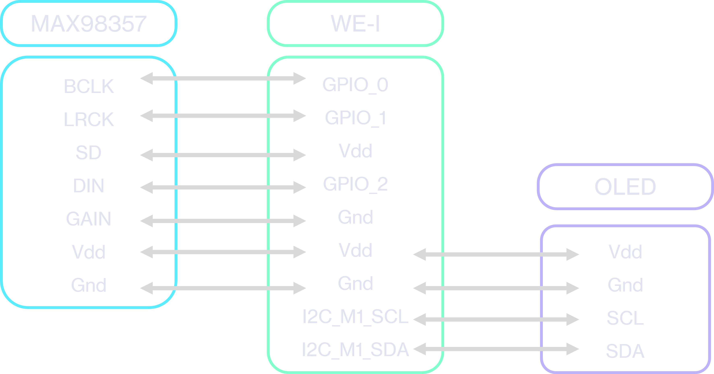
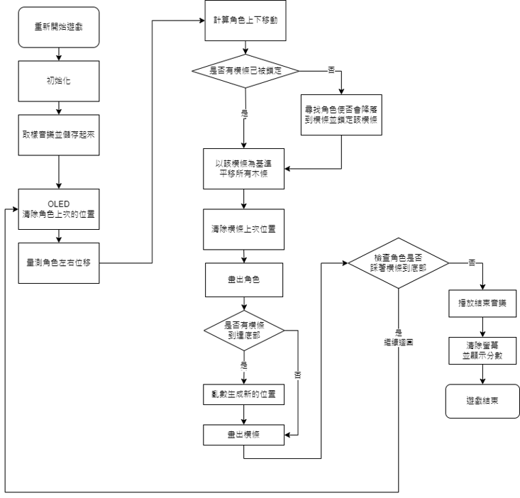

# Doodle Jump on Himax WE-I Plus
## Materials
- Himax WE-I Plus
- LSM9DS1 IMU sensor (on WE-I) (For detecting motion of player)
- OLED (Screen)
- MAX98357 (For sound effect)

## Wiring

## Function
1. Push Reset button on WE-I to start the game
2. Tilt the board to control the character's movement. The goal is to land on a bar without falling onto the ground.
3. The current score will be displayed on the top-right corner of the screen.
4. If the character falls to the ground, the game will end, and the speaker will play the end-game sound effect of Mario Bros.
5. The final score will be displayed on the screen. 

## Flow Chart

## Implementation
### Free Falling of Character
I use an array to control the amount of vertical movement, so as to simulate the free falling illusion.

### Character's Left/Right Movement
To prevent the motion of character to be too sensitive, there's a threshold. The player has to lean the board for a while, the character will start to move.

### Screen Scrolling
To calculate how much should the screen scroll down, program will calcualte which bar the character is locked with, and calcuate the displacement of that locked bar, so as to sync all other bars. Then it can make the screen seems scrolling.

### Drawing Character, Numbers, Text
I draw the contour of character, numbers, and text using "Painter", and then turn them into hexidemal and save them.

### Demo
